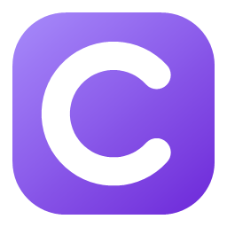
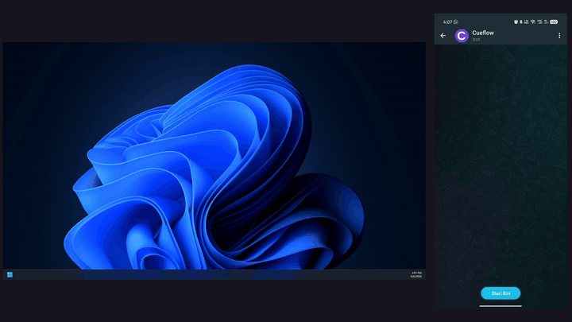
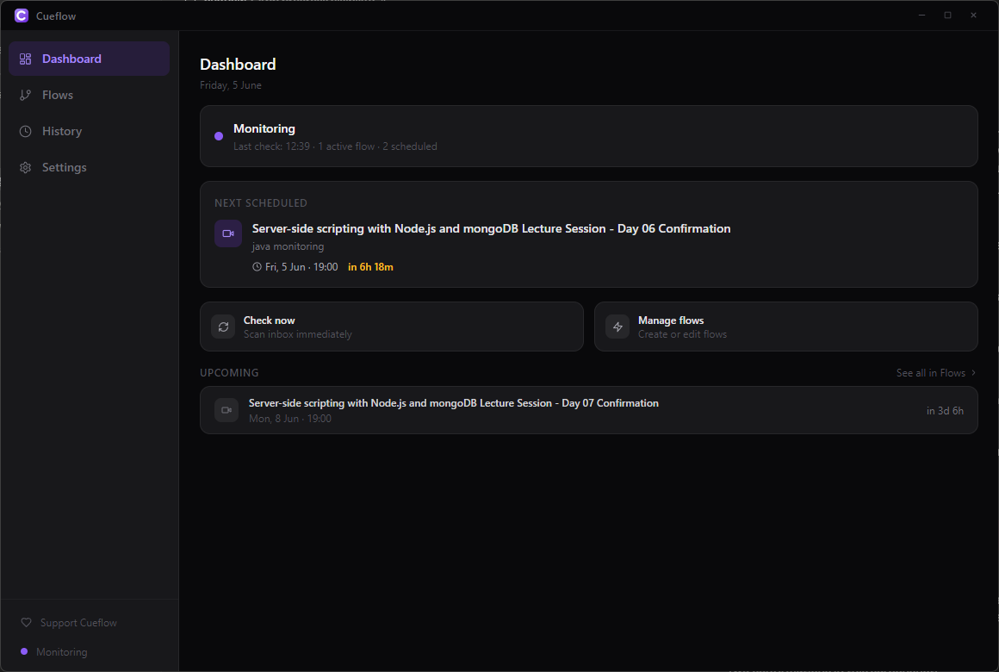
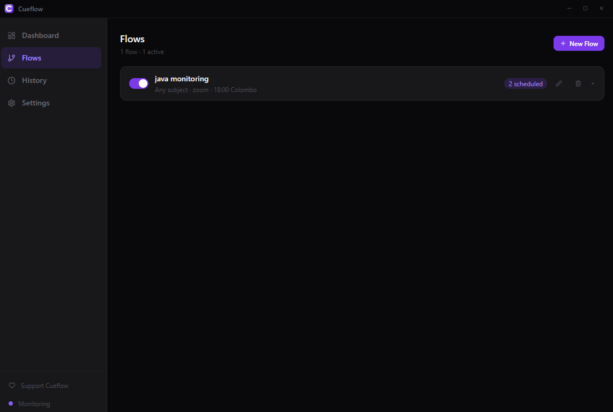
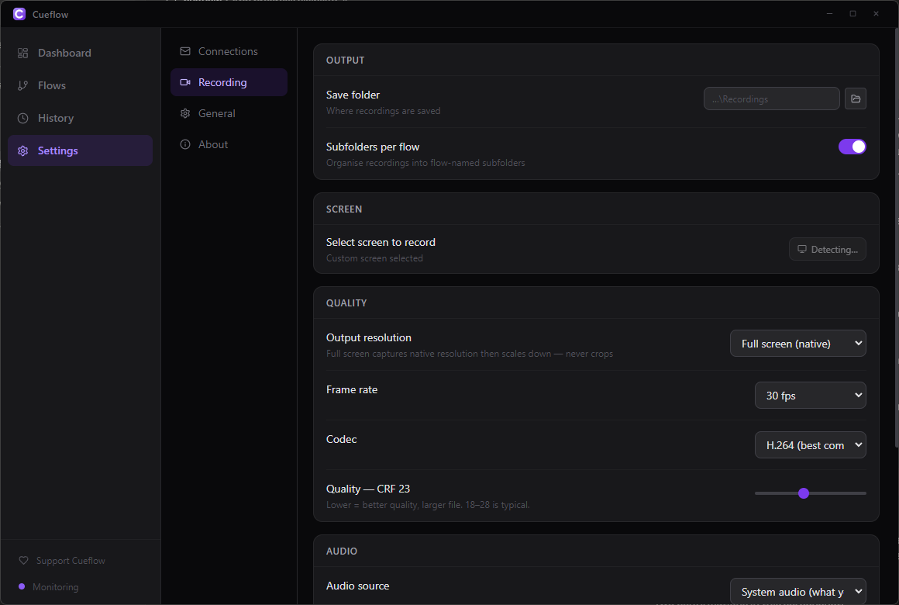
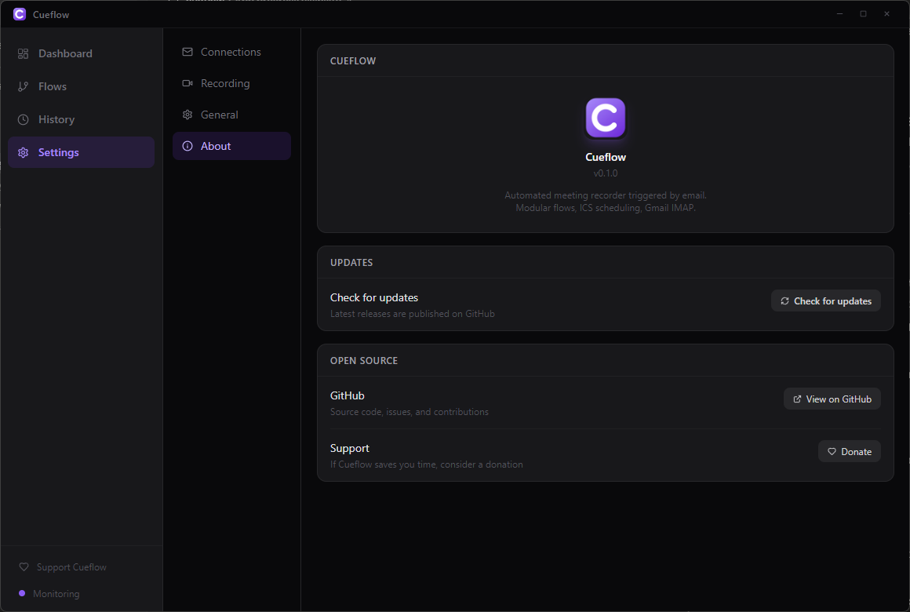

<div align="center">



# Cueflow

**Automated meeting recorder triggered by email**

[](https://github.com/Dushmantha-Amarasinghe/cueflow/releases/latest)
[](https://github.com/Dushmantha-Amarasinghe/cueflow/releases)
[](https://github.com/Dushmantha-Amarasinghe/cueflow/releases)
[](LICENSE)
[](https://github.com/Dushmantha-Amarasinghe/cueflow/stargazers)

Cueflow watches your Gmail inbox for meeting invitations, extracts the schedule from ICS attachments, then automatically joins and records with OBS — compressing to HEVC in the background. Control everything from Telegram, even from your phone.

### [Download for Windows](https://github.com/Dushmantha-Amarasinghe/cueflow/releases/latest/download/Cueflow-Setup.exe) · [Website](https://dushmantha-amarasinghe.github.io/cueflow/) · [Report a Bug](https://github.com/Dushmantha-Amarasinghe/cueflow/issues)

<a href="https://dushmantha-amarasinghe.github.io/">
  
</a>



</div>

---

## The killer feature: control from your phone

Out at dinner when a lecture starts? **Paste the meeting link to your Telegram bot** — your PC at home opens it, starts recording, compresses the file to HEVC, and sends it right back to your chat. Stop, check status, switch screens, manage flows — all remotely.

---

## Features

- **Email-triggered automation** — watches Gmail via IMAP, no OAuth required (App Password only)
- **ICS/calendar aware** — parses `.ics` attachments and recurring events to schedule recordings in advance
- **Flows** — modular, named automation pipelines; run multiple flows in parallel with independent rules
- **OBS recording** — bundled OBS Studio captures your screen at full quality; system audio (WASAPI loopback), mic, or both; multi-monitor selection; CRF quality slider
- **HEVC compression** — after recording, bundled ffmpeg silently re-encodes to x265 in the background; a 70 MB lecture becomes ~1 MB without visible quality loss
- **Telegram screen control** — during recording, view live screenshots of every monitor, switch the OBS capture to a different screen with one tap, retry window maximize
- **Telegram bot** — rich notifications, inline buttons, `/join`, `/stop`, `/schedule`, `/flows`, `/history` and more
- **Auto-update** — checks GitHub Releases on startup and notifies you when a new version is available
- **100% local** — no cloud, no central server, no subscription; credentials encrypted via Electron safeStorage

## Download

[**Download the latest installer**](https://github.com/Dushmantha-Amarasinghe/cueflow/releases/latest/download/Cueflow-Setup.exe) — OBS and ffmpeg are bundled, nothing else to install.

> **Requirements:** Windows 10 / 11 (64-bit). Zoom, Teams, or any meeting app already installed.
>
> **Note:** Cueflow isn't code-signed yet, so Windows SmartScreen may warn about an "unknown publisher." Click **More info → Run anyway** — the full source is here if you'd like to verify or build it yourself.

## Screenshots

| | |
|---|---|
|  |  |
| **Dashboard** — live status & upcoming sessions | **Flows** — your automation pipelines |
|  |  |
| **Recording** — screen, encoder, audio & post-compression | **Settings** — connections, Telegram & about |

## Getting started

1. Run the installer — OBS and ffmpeg are bundled, nothing else to install
2. On first launch the setup wizard guides you through:
   - **Gmail** — enter your address + a [Google App Password](https://myaccount.google.com/apppasswords)
   - **Telegram** *(optional)* — paste your bot token + chat ID for phone notifications and file delivery
3. Go to **Flows → New Flow**, set a subject filter (e.g. `"Zoom"`) and choose your meeting type
4. That's it — Cueflow monitors your inbox and records matching meetings automatically

## Telegram bot commands

| Command | Description |
|---------|-------------|
| `/status` | Engine state & current recording |
| `/schedule` | All upcoming sessions |
| `/schedule <name>` | Sessions for a specific flow |
| `/flows` | View & manage flows |
| `/next` | Next session countdown |
| `/history` | Recent recordings |
| `/join <url>` | Join & record a meeting now |
| `/stop` | Stop current recording |
| `/pause <name>` | Pause a flow |
| `/resume <name>` | Re-enable a flow |

During a recording, inline buttons let you **view screenshots**, **switch capture screen**, **retry maximize**, and **stop** — all without opening the app.

## Configuration

### Gmail App Password

Google App Passwords let Cueflow access your inbox without your real password and without OAuth.

1. Go to [myaccount.google.com/apppasswords](https://myaccount.google.com/apppasswords)
2. Create an app password for **Mail**
3. Paste the 16-character password into Cueflow → Settings → Connections

### Telegram bot (optional)

1. Message [@BotFather](https://t.me/BotFather) on Telegram → `/newbot`
2. Copy the bot token into Settings → Connections → Telegram
3. Find your Chat ID with [@userinfobot](https://t.me/userinfobot)
4. Press **Connect & Test** — you'll receive a test message immediately

### Recording settings

| Setting | Default | Notes |
|---------|---------|-------|
| Save folder | `Documents\Cueflow\Recordings` | Subfolders per flow optional |
| Resolution | Native (full screen) | Can scale down to 1080p, 720p, etc. |
| Frame rate | 30 fps | |
| Encoder | H.264 Software (x264) | NVENC, AMF, QuickSync detected automatically |
| Quality (CRF) | 28 | 0 = lossless, 51 = smallest; 18–28 recommended |
| Audio | System audio (WASAPI loopback) | Mic, both, or none also available |
| Post-compression | On (Smart) | HEVC CRF 30 · fast — re-encodes in background after recording |

## Building from source

```bash
# Prerequisites: Node.js 18+, Git

git clone https://github.com/Dushmantha-Amarasinghe/cueflow.git
cd cueflow
npm install

# Development (hot reload)
npm run dev

# Build installer
npm run dist
```

The installer will be in `dist/`.

## Tech stack

| Layer | Technology |
|-------|-----------|
| UI | Electron + React (Vite) |
| Recording | OBS Studio (bundled, portable) |
| Compression | ffmpeg · libx265 HEVC (bundled) |
| Email | imapflow + mailparser |
| Scheduling | node-ical + rrule-temporal + node-schedule |
| Notifications | Telegraf (Telegram Bot API) |
| Storage | JSON files (local, encrypted credentials via Electron safeStorage) |
| Auto-update | electron-updater + GitHub Releases |

## Contributing

Pull requests are welcome. For major changes please open an issue first.

1. Fork the repo
2. Create a feature branch (`git checkout -b feature/my-feature`)
3. Commit your changes
4. Push and open a PR

## Support

If Cueflow saves you time:

[](https://www.paypal.com/donate?business=dsbamarasinghe1234@gmail.com&currency_code=USD&amount=5)

## License

[MIT](LICENSE) — free to use, modify, and distribute.

---

<div align="center">
Made by <a href="https://dushmantha-amarasinghe.github.io/">Dushmantha Amarasinghe</a> · <a href="https://dushmantha-amarasinghe.github.io/">More apps →</a>
</div>
